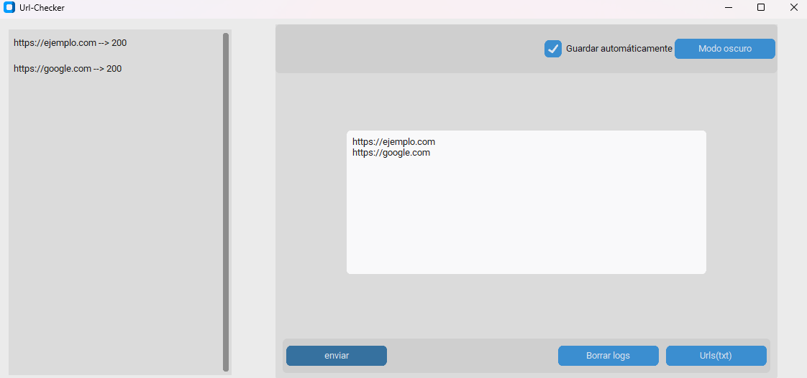

# Url-Checkers

This repository contains 5 scripts to view the **status code** of a web page.

clone with:
`git clone https://github.com/MyCode83/Url-Checkers.git`

## Description
- **Url-Checker-txt1** ---> Check the status code of multiple URLs within a text file (txt)

- **Url-Checker2** --->  Checks the status code of a URL with a brief explanation, and can optionally return the response headers in JSON.

- **URL-go** ---> It's like **Url-checker2** but made in go but return the response http and has a flag -url to pass it.

- **Url-Argparse** --->  This Script checks the status and content of a **URL** using `argparse`, with support for showing the status code, the **HTML** response, and using custom **JSON** headers.

- **Url-GUI**  --->  This is a **GUI** version built with CustomTkinter that checks **URLs** from a **TXT** file or allows manual input. It includes an optional auto-save feature to store logs automatically, as well as a manual save    
                     option to export logs in **TXT** or **LOG** format.
## Requirements
---
### Url-Checker-txt1
> `Colorama`
> `httpx`
> `fake-useragent`

`python3 -m pip install Colorama httpx fake-useragent`
### Url-Checker2
> `Colorama`
> `httpx`
> `fake-useragent`

### URL-go
> `go 1.8+`
> `resty`

`go mod init check`, `go get github.com/go-resty/resty/v2`, `go build check.exe` if you want in $GOPATH `go install`

`python3 -m pip install Colorama httpx fake-useragent`
### Url-GUI
> `CustomTkinter`
> `httpx`
> `fake-useragent`

`python3 -m pip install CustomTkinter Colorama httpx fake-useragent`
### Url-Argparse
> `Httpx`
> `Colorama`

`python3 -m pip install httpx colorama`

### Screenshot-gui

### Disclaimer
> Este proyecto está creado únicamente con fines **educativos y de aprendizaje**.  
> El autor **no se hace responsable** del uso indebido que puedan darle terceras personas.

### Disclaimer

> This project is created solely for **educational and learning purposes**.
> 
> The author **is not responsible** for any misuse by third parties.
